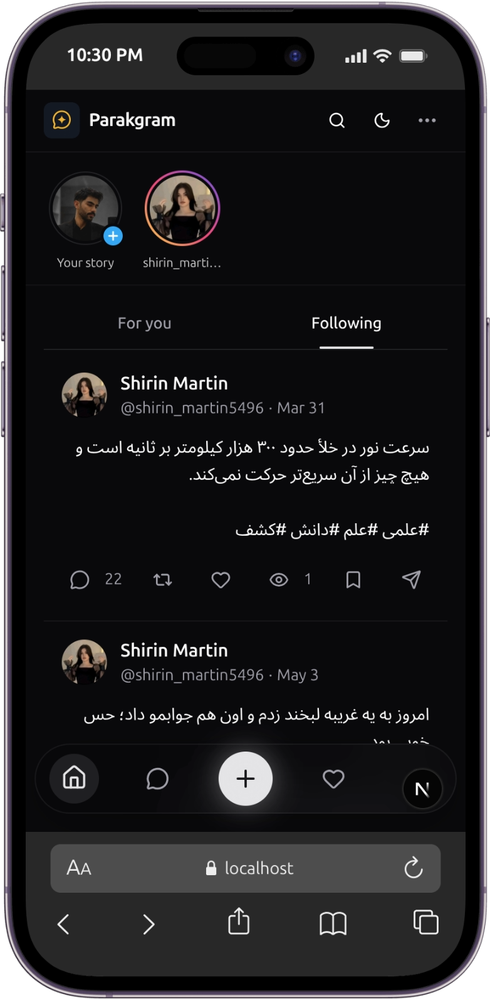
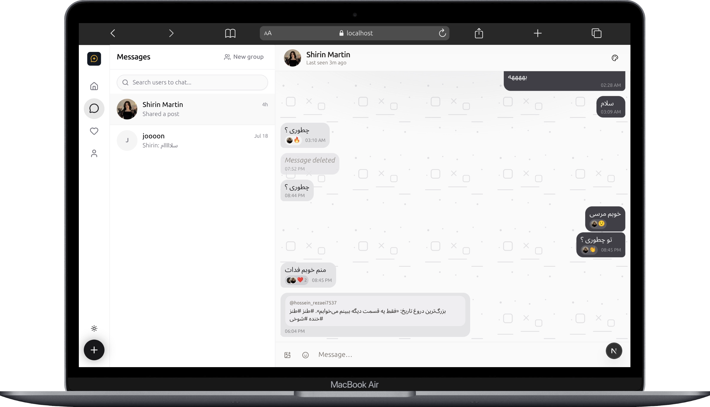

# Parakgram

<p align="center">
  
</p>

**Parakgram** — named for Parak, Soheil's star. Share, connect, and shine.

A modern social microblogging platform built with Next.js. Post, reply, share stories, follow people, and chat in real time — with a polished UI that works on mobile and desktop.

---

## Screenshots

### Mobile feed

Dark-mode home feed on iPhone — stories, For you / Following tabs, and Twitter-style posts with likes, replies, reposts, and bookmarks.

<p align="center">
  
</p>

### Desktop messaging

Light-mode real-time chat on desktop — conversation list, message bubbles, reactions, shared posts, and group chat support.

<p align="center">
  
</p>

---


## Features


### Social feed

- **For you** and **Following** home feeds
- Create posts with text, images, hashtags, and mentions
- Nested reply threads, likes, reposts, pins, and bookmarks
- Polls with live voting
- Tag pages and full-text explore/search (users, tags, posts)
- Personalized recommendations and suggested people


### Stories

- 24-hour stories (text & image)
- Viewers list, likes, and story replies (sent as DMs)
- Animated Lottie reactions


### Profiles & social graph

- Public profiles with posts, replies, and reposts tabs
- Follow / unfollow, followers & following lists
- Follow requests for private accounts
- View history and saved bookmarks


### Messaging

- Direct messages and **group** chats
- Real-time updates via Server-Sent Events (SSE)
- Typing indicators, read receipts, and presence
- Message reactions, edit/delete, forwarding
- Share posts into conversations
- Per-chat themes and wallpaper proposals


### Activity & auth

- Notifications with live unread count (SSE)
- JWT cookie auth (access + refresh tokens)
- Register, login, forgot & reset password
- Change password from settings


### UI / UX

- Light, dark, and system themes
- Extra color themes (Ocean Blue, Forest Green, Purple Haze, Sunset Orange, Rose Gold)
- Responsive layout for phone and desktop
- Bidirectional text (`dir="auto"`) for mixed / Persian content

---


## Tech stack


| Layer         | Technology                                                |
| ------------- | --------------------------------------------------------- |
| Framework     | [Next.js](https://nextjs.org/) 15 (App Router, Turbopack) |
| UI            | React 19, Tailwind CSS 4, shadcn/ui, Radix UI             |
| Data fetching | TanStack Query, Axios                                     |
| Forms         | React Hook Form + Zod                                     |
| Database      | MongoDB + Mongoose                                        |
| Auth          | JWT (`jose`) in HTTP-only cookies, bcrypt                 |
| Realtime      | Server-Sent Events                                        |
| Motion        | Framer Motion, Lottie, Swiper                             |
| Themes        | next-themes                                               |


---


## Getting started


### Prerequisites

- Node.js 18+
- MongoDB (local or Atlas)


### 1. Clone & install

```bash
git clone https://github.com/YOUR_USERNAME/my-forum.git
cd my-forum
npm install
```


### 2. Environment variables

Create a `.env` file in the project root:

```env
MONGODB_URI=mongodb://127.0.0.1:27017/parakgram
JWT_ACCESS_SECRET=your-access-secret-min-32-chars
JWT_REFRESH_SECRET=your-refresh-secret-min-32-chars
```


| Variable             | Description                          |
| -------------------- | ------------------------------------ |
| `MONGODB_URI`        | MongoDB connection string            |
| `JWT_ACCESS_SECRET`  | Secret for short-lived access tokens |
| `JWT_REFRESH_SECRET` | Secret for refresh tokens            |


### 3. Run the app

```bash
npm run dev
```

Open [http://localhost:3000](http://localhost:3000).

### Optional: seed data

```bash
node --env-file=.env scripts/seedUsers.mjs
node --env-file=.env scripts/seedPosts.mjs
node --env-file=.env scripts/seedReplies.mjs
```

Seeded users use a shared password documented in `scripts/seed-users.output.json` after seeding.

### Optional: recommendations job

```bash
npm run precompute:recommendations
```

---


## Scripts


| Command                              | Description                            |
| ------------------------------------ | -------------------------------------- |
| `npm run dev`                        | Start development server (Turbopack)   |
| `npm run build`                      | Production build                       |
| `npm run start`                      | Start production server                |
| `npm run lint`                       | Run ESLint                             |
| `npm run migrate:follows`            | Backfill follow graph data             |
| `npm run precompute:recommendations` | Compute trending / popular suggestions |
| `npm run smoke:recommendations`      | Smoke-test recommendation endpoints    |


---


## Project structure

```
├── public/                 # Static assets, logos, uploads, reactions
│   └── Images/             # App screenshots
├── scripts/                # Seed, migrate, and recommendation jobs
└── src/
    ├── app/                # App Router pages & API routes
    ├── components/         # UI (chat, posts, stories, profile, …)
    ├── context/            # Auth context
    ├── hook/               # React Query hooks
    ├── lib/                # Auth, DB, chat, recommendations, …
    ├── models/             # Mongoose models
    ├── middleware.ts       # Route protection
    └── types/              # Shared TypeScript types
```

---


## License

This project is private (`"private": true` in `package.json`). Add a license file if you plan to open-source it.
`)